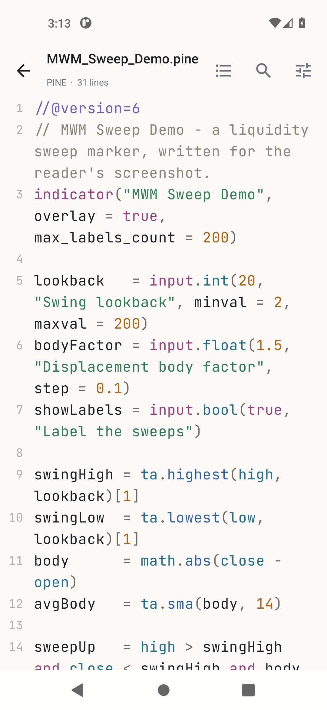
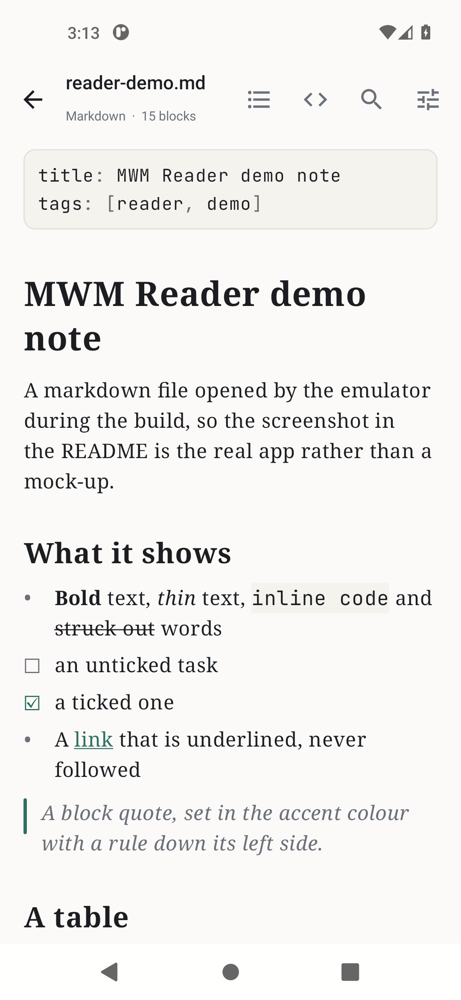

# MWM Reader



A quiet document reader for Android. Point it at a file and it shows the file:
prose in a reading font, code with syntax colouring, markdown laid out, PDFs
drawn page by page, spreadsheets as tables. That is the whole job.

- **No ads, no account, no tracking, no cost.** The app does not hold the
  internet permission, so it has no way to fetch an advert, phone home, or send
  the document you are reading anywhere. Check the manifest; it is four lines.
- **Opens a lot of things:** plain text, markdown, 60-odd source languages
  including Pine Script, PDF, EPUB, HTML, CSV and TSV, RTF, Word, Excel,
  PowerPoint, OpenDocument, and images.
- **Reads well:** four page themes, three typefaces, adjustable size, line
  spacing and margins, and it remembers where you stopped in every file.
- **Find in file** with a hit counter and next / previous, on any text format.
- **A contents list** built from markdown headings, EPUB chapters, and the
  functions and classes in a source file.
- **Folders you add stay added**, so a notes or scripts folder is two taps away.

## 📲 Download

**[⬇ Latest APK](https://github.com/Matswm86/mwm-reader/releases/download/latest/mwm-reader-801d9bb.apk)**
&nbsp;·&nbsp; [all builds](https://github.com/Matswm86/mwm-reader/releases)

Open the link on your phone, tap the file, and allow "install from this source"
when Android asks. Android 8.0 or newer (minSdk 26). The filename carries the
commit id on purpose, so your browser can never serve you a cached old build. If
the link 404s, a newer build has landed: take the newest `mwm-reader-*.apk` off
the releases page.

Debug-signed. Reinstalling over a build with a different signature means
uninstalling the old one first.

## What it opens

| Kind | Extensions | How it is shown |
|------|-----------|-----------------|
| Prose | `txt` `log` `nfo` `rst` `org` `adoc` `srt` `vtt` | Reading font, wrapped, no line numbers |
| Markdown | `md` `markdown` `mdx` `qmd` | Headings, lists, task boxes, quotes, tables, fenced code; a toggle shows the source |
| Code | `pine` `py` `kt` `java` `js` `ts` `c` `cpp` `cs` `go` `rs` `rb` `php` `swift` `lua` `sh` `sql` `json` `yaml` `toml` `xml` `css` `hs` `lisp` `r` `pl` `diff` and more | Monospace, syntax colouring, line numbers, optional wrapping |
| PDF | `pdf` | Page by page, pinch to zoom, inverted on the dark themes |
| E-books | `epub` | Chapter by chapter, with the book's own contents list |
| Web | `html` `htm` `xhtml` | Rendered as text blocks. Nothing is fetched and no script runs |
| Tables | `csv` `tsv` `psv` | A grid with a pinned header row and numbered rows |
| Office | `docx` `xlsx` `pptx` `odt` `ods` `odp` | Text, headings, lists and tables extracted from the file |
| Rich text | `rtf` | Control words stripped, words kept |
| Images | `png` `jpg` `webp` `gif` `bmp` `heic` `avif` | Pinch to zoom and pan |

A file with no extension, or one a file manager labels
`application/octet-stream`, is sniffed: if the bytes are text it opens as text,
and if they are not the reader says so instead of showing mojibake.

## Using it



**Open a file** uses Android's own picker, so the reader never asks for
all-files access. **Add a folder** grants read access to one folder, which then
appears on the home screen and can be browsed inside the app. Anything opened
lands in **Recent**, with the position you stopped at.

The toolbar carries, left to right: back, the contents list (when the file has
one), the markdown source toggle, find in file, and the reading settings.

Reading settings live in one sheet: **Paper**, **Sepia**, **Dusk** and **Black**
page themes plus **Auto** to follow the system, a sans / serif / mono choice for
prose, sliders for text size, line spacing and side margin, keep-the-screen-on,
and two switches for code (wrap long lines, line numbers). Code is always set in
JetBrains Mono whatever the prose typeface is.

## What it deliberately does not do

- **No network, at all.** No cloud sync, no "open from Drive", no font
  downloading, no crash reporting, no update check. The permission is not in the
  manifest, so these are not settings that could be switched on later.
- **No editing.** It is a reader. Nothing it opens is ever written back.
- Office files are **text extraction, not layout**. Columns, page breaks,
  floating images, charts and fonts are not reproduced, and the reader prints a
  line at the end of the document saying so.
- Legacy binary `.doc`, `.xls` and `.ppt` are not supported, only the modern
  zipped formats. The app says which it is looking at rather than showing
  gibberish.
- A PDF has no text layer the app can search, so find-in-file is offline for
  PDFs and the button is hidden rather than lying about it.
- Text files above 12 MB are cut off at that point, with a note where the cut
  happened.

## The pictures above

They are not mock-ups. Every CI build installs the APK on an Android emulator,
pushes a generated Pine script, markdown note, PDF and CSV onto it, opens each
one, and checks from the view hierarchy that the right things are on screen: the
Pine file's `ta.highest` call, the markdown's rendered heading, `Page 1 / 1` on
the PDF, a CSV cell, and a working find-in-file hit counter. The screenshots are
taken at those moments.

## Build

Kotlin, Jetpack Compose, Material 3. JDK 17, compileSdk 35, minSdk 26. No
third-party runtime dependencies beyond AndroidX and kotlinx: the PDF engine is
Android's own `PdfRenderer`, and the markdown, HTML, EPUB, Office, RTF, CSV and
syntax-highlighting code is in this repository.

```bash
./gradlew testDebugUnitTest assembleDebug
```

Every push to `main` is built by GitHub Actions
([workflow](.github/workflows/build-android.yml)), which runs the unit tests,
publishes the APK to the rolling `latest` release, rewrites the download link
above, and then runs the emulator check.

## License

[MIT](LICENSE). The code font is JetBrains Mono, under the
[SIL Open Font License](licenses/JetBrainsMono-OFL.txt).
